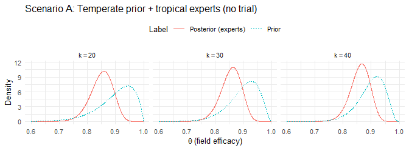
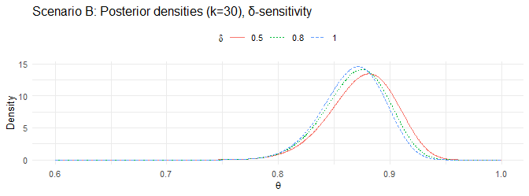
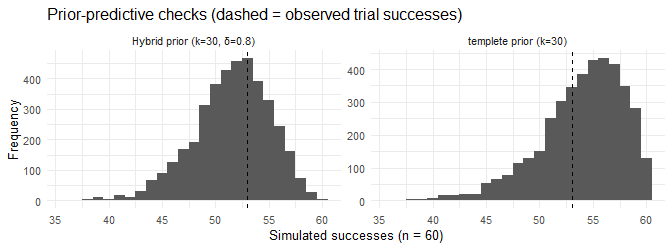

Supplementary Material: Bayesian integration of expert elicitation and
early trial evidence for tropical deployment of a phytosanitary practice
================
Robledo et al.
2025-08-24

- [1 Context and goal](#1-context-and-goal)
- [2 Model and notation](#2-model-and-notation)
- [3 Scenarios and workflow](#3-scenarios-and-workflow)
- [4 Implementation](#4-implementation)
- [5 Fixed inputs for
  reproducibility](#5-fixed-inputs-for-reproducibility)
- [6 Expert judgements as data (encoding and ESS
  control)](#6-expert-judgements-as-data-encoding-and-ess-control)
- [7 Scenario A — Temperate prior + tropical experts (no
  trial)](#7-scenario-a--temperate-prior--tropical-experts-no-trial)
  - [7.1 Visualization (Scenario A)](#71-visualization-scenario-a)
- [8 Scenario B — Hybrid prior + small tropical trial
  (δ-sensitivity)](#8-scenario-b--hybrid-prior--small-tropical-trial-δ-sensitivity)
  - [8.1 Visualization (Scenario B)](#81-visualization-scenario-b)
- [9 Scenario C — Trial-only baseline (Bayesian &
  frequentist)](#9-scenario-c--trial-only-baseline-bayesian--frequentist)
- [10 Comparative uncertainty (95% interval
  widths)](#10-comparative-uncertainty-95-interval-widths)
- [11 Prior-predictive checks
  (sanity)](#11-prior-predictive-checks-sanity)
- [12 Interpretation](#12-interpretation)
- [13 Assumptions and diagnostics (technical
  notes)](#13-assumptions-and-diagnostics-technical-notes)
- [14 Session info](#14-session-info)

# 1 Context and goal

A new race of a virulent pathogen has appeared for the first time in
**tropical** areas; previously it was contained in **temperate**
regions. There is no curative treatment, and **regional biosecurity
practices** have been the most effective way to suppress spread in
temperate zones. The phytosanitary program’s question is: **how
confident are we that these practices will work in the tropics, given no
tropical experiments initially?**

We define **field efficacy** as $\theta$, the probability a treated unit
(farm) **avoids infection in a 30-day assessment**. Temperate field
studies suggest $\theta \approx 0.90$, but tropical modifiers (**higher
UV load**, **winds**, and **grower compliance/enforcement**) could shift
performance. We therefore treat the temperate field result as a
**moderately strong prior**, not an absolute truth, and let **tropical
experts** encode region-specific modifiers. The approach below shows how
to:

- use **expert elicitation** as data when tropical trials do not yet
  exist;
- **blend** expert knowledge with early tropical data once they arrive
  (a **hybrid** update);
- present a **trial-only baseline** that aligns with familiar
  frequentist intervals.

The emphasis is on **uncertainty quantification** (how wide or tight the
efficacy distribution is), not just point estimates.

# 2 Model and notation

We model tropical field outcomes for $\theta$ using a Binomial–Beta
framework:

$$
Y \mid \theta \sim \mathrm{Binomial}(n,\theta),\qquad
\theta \sim \mathrm{Beta}(\alpha,\beta).
$$

The Beta prior has mean $\mu=\frac{\alpha}{\alpha+\beta}$ and
**effective sample size (ESS)** $k=\alpha+\beta$. In a conjugate update
with $y$ successes out of $n$, the posterior is

$$
\theta \mid y,n \sim \mathrm{Beta}(\alpha+y,\ \beta+n-y).
$$

In simple words when $\alpha$ and $\beta$ are used as prior they act
like **pseudo-counts** of “successes” and “failures,” so $k$ is how hard
the prior “pushes.” Expert inputs are encoded as small binomial
“pseudo-trials,” which behave like additional successes/failures. This
allows to control how much weight each source carries.

**Temperate field prior.** We set $\mu_{\text{prior}}=0.90$ with
$k_{\text{prior}}\in\{20,30,40\}$ to reflect imperfect transportability
to the tropics (stronger $k$ = more trust in temperate evidence).

# 3 Scenarios and workflow

We present three **scenarios** corresponding to common decision stages.

- **Scenario A — Temperate prior + tropical experts (no tropical trial
  yet).** All experts are from the tropical region and judge how UV,
  wind, and compliance affect efficacy. Each expert $j$ is encoded as
  binomial pseudo-trials $(y_j,n_j)$ via a simple **confidence rubric**
  (Low/Medium/High ↦ $n_j = 10/20/30$). We **cap** total expert ESS at
  60 to avoid over-weighting, and we also show a **rubric-shrink**
  sensitivity (halve all $n_j$ after capping).

- **Scenario B — Hybrid prior + small tropical trial.** We **borrow**
  expert information into the prior using a **power prior** with weight
  $\delta\in\{0.5,0.8,1.0\}$, then update with a small tropical trial.
  Borrowing stabilizes small-$n$ data without overpowering it.

- **Scenario C — Trial-only baseline.** We analyze a small tropical
  trial alone using **Bayesian non-informative** Beta(1,1) and
  **frequentist** Wilson and exact (Clopper–Pearson) 95% intervals. This
  demonstrates that when little weight is given to the prior (i.e.,
  non-informative priors), the results of frequentist and Bayesian
  approaches are comparable.

# 4 Implementation

``` r
suppressPackageStartupMessages({
  library(ggplot2)
  library(knitr)
  library(dplyr)
})
```

``` r
to_pct   <- function(x, d=1) sprintf(paste0("%.", d, "f%%"), 100*x)
beta_var <- function(a,b) a*b/((a+b)^2*(a+b+1))

wilson_ci <- function(y, n, conf.level=0.95) {
  z <- qnorm(1 - (1-conf.level)/2)
  p <- if (n>0) y/n else 0
  denom <- 1 + z^2/n
  center <- (p + z^2/(2*n)) / denom
  half <- (z * sqrt( (p*(1-p)/n) + z^2/(4*n^2) )) / denom
  c(lower = max(0, center - half), upper = min(1, center + half))
}

summ_beta <- function(a,b,label="") {
  m  <- a/(a+b)
  md <- qbeta(0.5, a, b)
  sd <- sqrt(beta_var(a,b))
  ci <- qbeta(c(0.025,0.975), a, b)
  w95 <- diff(ci)
  data.frame(Label=label, alpha=a, beta=b, ESS=a+b,
             Mean=m, Median=md, SD=sd, CrI_L=ci[1], CrI_U=ci[2], Width95=w95)
}
```

# 5 Fixed inputs for reproducibility

We fix the **small tropical trial** at 53/60 and simulate experts once
with a fixed seed (above). The “templete prior” mean is 0.90.

``` r
# Temperate prior (same endpoint and window)
theta_templete_mean <- 0.90

# Small tropical trial (observed)
n_trial <- 60
y_trial <- 53
cat("Tropical trial outcome (fixed for reproducibility): y =", y_trial,
    "of n =", n_trial, " (", to_pct(y_trial/n_trial,1), ")\n", sep="")
```

    ## Tropical trial outcome (fixed for reproducibility): y =53of n =60 (88.3%)

# 6 Expert judgements as data (encoding and ESS control)

We simulate 10 tropical experts. Each expert’s internal belief (for
simulation only) is drawn near ~0.86–0.90 with dispersion. We then
encode judgments as pseudo-trials using the rubric, **cap** total ESS at
60, and apply a **rubric-shrink** sensitivity (50% after cap).

``` r
J <- 10
# Simulate expert beliefs near high efficacy with dispersion
theta_expert_belief <- rbeta(J, shape1 = 43, shape2 = 7)  # mean~0.86, sd~0.05 (illustrative)

rubric_levels <- c("Low","Medium","High")
rubric_n <- c(Low=10, Medium=20, High=30)
set.seed(123)
expert_conf <- sample(rubric_levels, J, replace=TRUE, prob=c(0.3,0.5,0.2))
n_j <- unname(rubric_n[expert_conf])
y_j <- rbinom(J, size = n_j, prob = theta_expert_belief)

kable(data.frame(Expert=1:J, Confidence=expert_conf, n_j, y_j),
      caption = "Expert pseudo-trials from confidence rubric (pre-cap).")
```

| Expert | Confidence | n_j | y_j |
|-------:|:-----------|----:|----:|
|      1 | Medium     |  20 |  15 |
|      2 | Low        |  10 |   9 |
|      3 | Medium     |  20 |  14 |
|      4 | High       |  30 |  25 |
|      5 | High       |  30 |  28 |
|      6 | Medium     |  20 |  14 |
|      7 | Low        |  10 |  10 |
|      8 | High       |  30 |  29 |
|      9 | Low        |  10 |   9 |
|     10 | Medium     |  20 |  14 |

Expert pseudo-trials from confidence rubric (pre-cap).

``` r
# Cap expert ESS at 60
ess_cap <- 60
ess_sum <- sum(n_j)
shrink_cap <- if (ess_sum > ess_cap) ess_cap/ess_sum else 1
n_j_cap <- round(n_j * shrink_cap)
n_j_cap[n_j>0 & n_j_cap==0] <- 1
y_j_cap <- pmin(n_j_cap, round(y_j * (n_j_cap / pmax(1, n_j))))

# Rubric-shrink sensitivity (50% after cap)
rubric_shrink <- 0.5
n_j_cap_shr <- round(n_j_cap * rubric_shrink)
n_j_cap_shr[n_j_cap>0 & n_j_cap_shr==0] <- 1
y_j_cap_shr <- pmin(n_j_cap_shr, round(y_j_cap * (n_j_cap_shr / pmax(1, n_j_cap))))

cat("Total expert ESS pre-cap:", ess_sum,
    " | cap:", ess_cap,
    " | shrink factor:", round(shrink_cap,2),
    " | ESS after cap:", sum(n_j_cap),
    " | ESS after cap + 50% rubric shrink:", sum(n_j_cap_shr), "\n")
```

    ## Total expert ESS pre-cap: 200  | cap: 60  | shrink factor: 0.3  | ESS after cap: 60  | ESS after cap + 50% rubric shrink: 30

# 7 Scenario A — Temperate prior + tropical experts (no trial)

We vary the **prior strength** $k_{\text{prior}}\in\{20,30,40\}$ while
fixing the prior mean at 0.90.

``` r
k_grid <- c(20, 30, 40)
make_prior <- function(mu, k) c(alpha = mu*k, beta = (1-mu)*k, k=k)
priors <- do.call(rbind, lapply(k_grid, function(k) make_prior(theta_templete_mean, k)))
rownames(priors) <- paste0("k", k_grid)

kable(data.frame(k_prior=k_grid,
                 alpha=priors[, "alpha"], beta=priors[, "beta"],
                 Mean=round(priors[, "alpha"]/rowSums(priors[,1:2]), 4)),
      caption = "Temperate field priors (mean fixed at 0.90; varying strength k_prior).")
```

|     | k_prior | alpha | beta | Mean |
|-----|--------:|------:|-----:|-----:|
| k20 |      20 |    18 |    2 |  0.9 |
| k30 |      30 |    27 |    3 |  0.9 |
| k40 |      40 |    36 |    4 |  0.9 |

Temperate field priors (mean fixed at 0.90; varying strength k_prior).

``` r
scenarioA <- lapply(k_grid, function(k){
  ap <- theta_templete_mean*k; bp <- (1-theta_templete_mean)*k
  # Experts as data (cap only)
  yE <- sum(y_j_cap); nE <- sum(n_j_cap)
  a1 <- ap + yE; b1 <- bp + (nE - yE)
  post1 <- summ_beta(a1,b1, sprintf("Scenario A | k=%d | experts: cap-only (ESS=%d)", k, nE))
  # Experts as data (cap + 50% rubric shrink)
  yE2 <- sum(y_j_cap_shr); nE2 <- sum(n_j_cap_shr)
  a2 <- ap + yE2; b2 <- bp + (nE2 - yE2)
  post2 <- summ_beta(a2,b2, sprintf("Scenario A | k=%d | experts: cap+50%% shrink (ESS=%d)", k, nE2))
  prior <- summ_beta(ap,bp, sprintf("Prior | k=%d", k))
  list(prior=prior, post_cap=post1, post_shr=post2)
})
names(scenarioA) <- paste0("k", k_grid)

scenarioA_tbl <- do.call(rbind, lapply(scenarioA, function(x) rbind(x$prior, x$post_cap, x$post_shr)))
scenarioA_tbl_fmt <- scenarioA_tbl %>%
  mutate(across(c(Mean,Median,SD,CrI_L,CrI_U,Width95), ~ to_pct(.x, 2)))
kable(scenarioA_tbl_fmt, caption = "Scenario A: Posterior summaries with experts as data (cap-only vs cap+50% rubric shrink).")
```

|  | Label | alpha | beta | ESS | Mean | Median | SD | CrI_L | CrI_U | Width95 |
|----|:---|---:|---:|---:|:---|:---|:---|:---|:---|:---|
| k20.1 | Prior \| k=20 | 18 | 2 | 20 | 90.00% | 91.32% | 6.55% | 73.97% | 98.70% | 24.73% |
| k20.2 | Scenario A \| k=20 \| experts: cap-only (ESS=60) | 68 | 12 | 80 | 85.00% | 85.29% | 3.97% | 76.45% | 91.90% | 15.45% |
| k20.3 | Scenario A \| k=20 \| experts: cap+50% shrink (ESS=30) | 44 | 6 | 50 | 88.00% | 88.51% | 4.55% | 77.77% | 95.37% | 17.60% |
| k30.1 | Prior \| k=30 | 27 | 3 | 30 | 90.00% | 90.89% | 5.39% | 77.23% | 97.81% | 20.58% |
| k30.2 | Scenario A \| k=30 \| experts: cap-only (ESS=60) | 77 | 13 | 90 | 85.56% | 85.82% | 3.69% | 77.63% | 91.99% | 14.36% |
| k30.3 | Scenario A \| k=30 \| experts: cap+50% shrink (ESS=30) | 53 | 7 | 60 | 88.33% | 88.76% | 4.11% | 79.17% | 95.09% | 15.93% |
| k40.1 | Prior \| k=40 | 36 | 4 | 40 | 90.00% | 90.67% | 4.69% | 79.13% | 97.13% | 18.00% |
| k40.2 | Scenario A \| k=40 \| experts: cap-only (ESS=60) | 86 | 14 | 100 | 86.00% | 86.24% | 3.45% | 78.59% | 92.05% | 13.46% |
| k40.3 | Scenario A \| k=40 \| experts: cap+50% shrink (ESS=30) | 62 | 8 | 70 | 88.57% | 88.94% | 3.78% | 80.21% | 94.86% | 14.65% |

Scenario A: Posterior summaries with experts as data (cap-only vs
cap+50% rubric shrink).

## 7.1 Visualization (Scenario A)

``` r
plot_A <- do.call(rbind, lapply(k_grid, function(k){
  ap <- theta_templete_mean*k; bp <- (1-theta_templete_mean)*k
  yE <- sum(y_j_cap); nE <- sum(n_j_cap)
  a1 <- ap + yE; b1 <- bp + (nE - yE)
  x <- seq(0.6, 1.0, length.out = 1000)
  rbind(
    data.frame(theta=x, density=dbeta(x, ap,bp), Label="Prior", k=k),
    data.frame(theta=x, density=dbeta(x, a1,b1), Label="Posterior (experts)", k=k)
  )
}))
ggplot(plot_A, aes(theta, density, color=Label, linetype=Label)) +
  geom_line() +
  facet_wrap(~ k, nrow=1, labeller = label_bquote(k==.(k))) +
  labs(title="Scenario A: Temperate prior + tropical experts (no trial)",
       x=expression(theta~"(field efficacy)"), y="Density") +
  theme_minimal(base_size=10) + theme(legend.position="top")
```



# 8 Scenario B — Hybrid prior + small tropical trial (δ-sensitivity)

We **blend** experts into the prior via a **power prior** with
$\delta\in\{0.5,0.8,1.0\}$, then update with the tropical trial $y=53$
of $n=60$.

``` r
delta_grid <- c(0.5, 0.8, 1.0)
scenarioB_tbl <- NULL

for (k in k_grid) {
  ap <- theta_templete_mean*k; bp <- (1-theta_templete_mean)*k
  for (d in delta_grid) {
    yE <- sum(y_j_cap); nE <- sum(n_j_cap)
    ah <- ap + d*yE; bh <- bp + d*(nE - yE)             # Hybrid prior params (templete + δ*experts)
    prior_h <- summ_beta(ah,bh, sprintf("Hybrid prior | k=%d, delta=%.1f", k,d))
    a2 <- ah + y_trial; b2 <- bh + (n_trial - y_trial)  # Posterior with trial
    post_h <- summ_beta(a2,b2, sprintf("Scenario B posterior | k=%d, delta=%.1f", k,d))
    scenarioB_tbl <- rbind(scenarioB_tbl,
                           data.frame(Scenario="B", k_prior=k, delta=d,
                                      Prior_ESS=prior_h$ESS, Post_ESS=post_h$ESS,
                                      Prior_Mean=prior_h$Mean, Post_Mean=post_h$Mean,
                                      Prior_SD=prior_h$SD, Post_SD=post_h$SD,
                                      Prior_CrI_L=prior_h$CrI_L, Prior_CrI_U=prior_h$CrI_U,
                                      Post_CrI_L=post_h$CrI_L, Post_CrI_U=post_h$CrI_U,
                                      Prior_Width95=prior_h$Width95, Post_Width95=post_h$Width95))
  }
}

scenarioB_tbl_fmt <- scenarioB_tbl %>%
  mutate(across(c(Prior_Mean,Post_Mean,Prior_SD,Post_SD,
                  Prior_CrI_L,Prior_CrI_U,Post_CrI_L,Post_CrI_U,
                  Prior_Width95,Post_Width95), ~ to_pct(.x, 2)))
kable(scenarioB_tbl_fmt, caption = "Scenario B: Hybrid prior + tropical trial (k_prior × δ).")
```

| Scenario | k_prior | delta | Prior_ESS | Post_ESS | Prior_Mean | Post_Mean | Prior_SD | Post_SD | Prior_CrI_L | Prior_CrI_U | Post_CrI_L | Post_CrI_U | Prior_Width95 | Post_Width95 |
|:---|---:|---:|---:|---:|:---|:---|:---|:---|:---|:---|:---|:---|:---|:---|
| B | 20 | 0.5 | 50 | 110 | 86.00% | 87.27% | 4.86% | 3.16% | 75.23% | 94.06% | 80.47% | 92.80% | 18.83% | 12.33% |
| B | 20 | 0.8 | 68 | 128 | 85.29% | 86.72% | 4.26% | 2.99% | 76.03% | 92.60% | 80.35% | 92.00% | 16.58% | 11.66% |
| B | 20 | 1.0 | 80 | 140 | 85.00% | 86.43% | 3.97% | 2.88% | 76.45% | 91.90% | 80.31% | 91.57% | 15.45% | 11.26% |
| B | 30 | 0.5 | 60 | 120 | 86.67% | 87.50% | 4.35% | 3.01% | 77.07% | 93.96% | 81.05% | 92.77% | 16.89% | 11.72% |
| B | 30 | 0.8 | 78 | 138 | 85.90% | 86.96% | 3.92% | 2.86% | 77.41% | 92.65% | 80.88% | 92.02% | 15.24% | 11.15% |
| B | 30 | 1.0 | 90 | 150 | 85.56% | 86.67% | 3.69% | 2.77% | 77.63% | 91.99% | 80.80% | 91.60% | 14.36% | 10.80% |
| B | 40 | 0.5 | 70 | 130 | 87.14% | 87.69% | 3.97% | 2.87% | 78.43% | 93.86% | 81.55% | 92.74% | 15.43% | 11.19% |
| B | 40 | 0.8 | 88 | 148 | 86.36% | 87.16% | 3.64% | 2.74% | 78.50% | 92.66% | 81.34% | 92.04% | 14.16% | 10.70% |
| B | 40 | 1.0 | 100 | 160 | 86.00% | 86.88% | 3.45% | 2.66% | 78.59% | 92.05% | 81.24% | 91.63% | 13.46% | 10.39% |

Scenario B: Hybrid prior + tropical trial (k_prior × δ).

## 8.1 Visualization (Scenario B)

For readability, we show the posterior densities for
$k_{\text{prior}}=30$ across $\delta$.

``` r
k_show <- 30
ap <- theta_templete_mean*k_show; bp <- (1-theta_templete_mean)*k_show
yE <- sum(y_j_cap); nE <- sum(n_j_cap)
x <- seq(0.6, 1.0, length.out = 1000)
dfB <- NULL
for (d in delta_grid) {
  ah <- ap + d*yE; bh <- bp + d*(nE - yE)
  a2 <- ah + y_trial; b2 <- bh + (n_trial - y_trial)
  dfB <- rbind(dfB, data.frame(theta=x, density=dbeta(x,a2,b2), delta=factor(d)))
}
ggplot(dfB, aes(theta, density, color=delta, linetype=delta)) +
  geom_line() +
  labs(title="Scenario B: Posterior densities (k=30), δ-sensitivity",
       x=expression(theta), y="Density", color=expression(delta), linetype=expression(delta)) +
  theme_minimal(base_size=10) + theme(legend.position="top")
```



# 9 Scenario C — Trial-only baseline (Bayesian & frequentist)

We analyze the trial alone to show how much **wider** uncertainty is
without borrowing.

``` r
# Bayesian Beta(1,1)
a0 <- 1; b0 <- 1
aC <- a0 + y_trial; bC <- b0 + (n_trial - y_trial)
bayesC <- summ_beta(aC,bC,"Scenario C | Bayes Beta(1,1)")

# Frequentist
phat <- y_trial/n_trial
CI_w <- wilson_ci(y_trial, n_trial)
CI_e <- binom.test(y_trial, n_trial)$conf.int

scenarioC_tbl <- data.frame(
  Model = c("Bayes Beta(1,1)","Freq Wilson","Freq Exact"),
  Point = c(bayesC$Mean, phat, phat),
  Low95 = c(bayesC$CrI_L, CI_w[1], CI_e[1]),
  High95= c(bayesC$CrI_U, CI_w[2], CI_e[2]),
  Width95 = c(bayesC$Width95, diff(CI_w), diff(CI_e))
)

scenarioC_tbl_fmt <- scenarioC_tbl %>%
  mutate(across(c(Point, Low95, High95, Width95), ~ to_pct(.x, 2)))

kable(scenarioC_tbl_fmt, caption = "Scenario C: Trial-only (Bayesian non-informative and frequentist).")
```

| Model           | Point  | Low95  | High95 | Width95 |
|:----------------|:-------|:-------|:-------|:--------|
| Bayes Beta(1,1) | 87.10% | 77.78% | 94.16% | 16.39%  |
| Freq Wilson     | 88.33% | 77.82% | 94.23% | 16.41%  |
| Freq Exact      | 88.33% | 77.43% | 95.18% | 17.75%  |

Scenario C: Trial-only (Bayesian non-informative and frequentist).

# 10 Comparative uncertainty (95% interval widths)

We compare **95% interval widths** across scenarios to quantify
uncertainty reduction.

``` r
comp_widths <- tibble::tibble(
  Scenario = c(
    "A (k=20, cap-only)",
    "A (k=30, cap-only)",
    "A (k=40, cap-only)",
    "B (k=30, δ=0.5)",
    "B (k=30, δ=0.8)",
    "B (k=30, δ=1.0)",
    "C (Bayes Beta(1,1))"
  ),
  Width95 = c(
    scenarioA$k20$post_cap$Width95,
    scenarioA$k30$post_cap$Width95,
    scenarioA$k40$post_cap$Width95,
    scenarioB_tbl$Post_Width95[scenarioB_tbl$k_prior==30 & abs(scenarioB_tbl$delta-0.5)<1e-9][1],
    scenarioB_tbl$Post_Width95[scenarioB_tbl$k_prior==30 & abs(scenarioB_tbl$delta-0.8)<1e-9][1],
    scenarioB_tbl$Post_Width95[scenarioB_tbl$k_prior==30 & abs(scenarioB_tbl$delta-1.0)<1e-9][1],
    bayesC$Width95
  )
)

kable(comp_widths %>% mutate(Width95 = to_pct(Width95,2)),
      col.names = c("Scenario", "95% Width"),
      caption = "Comparative 95% interval widths (smaller = more precise).")
```

| Scenario            | 95% Width |
|:--------------------|:----------|
| A (k=20, cap-only)  | 15.45%    |
| A (k=30, cap-only)  | 14.36%    |
| A (k=40, cap-only)  | 13.46%    |
| B (k=30, δ=0.5)     | 11.72%    |
| B (k=30, δ=0.8)     | 11.15%    |
| B (k=30, δ=1.0)     | 10.80%    |
| C (Bayes Beta(1,1)) | 16.39%    |

Comparative 95% interval widths (smaller = more precise).

# 11 Prior-predictive checks (sanity)

We check whether priors imply plausible success counts $Y$ in a trial of
size $n=60$. We illustrate for $k_{\text{prior}}=30$ and the hybrid
prior with $\delta=0.8$.

``` r
prior_predictive <- function(alpha, beta, n, nsim=4000) {
  theta_draws <- rbeta(nsim, alpha, beta)
  rbinom(nsim, size=n, prob=theta_draws)
}

# templete prior at k=30
alpha_k30 <- theta_templete_mean*k_show; beta_k30 <- (1-theta_templete_mean)*k_show
y_ppc_templete <- prior_predictive(alpha_k30, beta_k30, n_trial)

# Hybrid prior at k=30, δ=0.8
yE <- sum(n_j_cap * 0 + y_j_cap); nE <- sum(n_j_cap)
ah <- alpha_k30 + 0.8*yE; bh <- beta_k30 + 0.8*(nE - yE)
y_ppc_hybrid <- prior_predictive(ah, bh, n_trial)

ppc_df <- rbind(
  data.frame(model="templete prior (k=30)", y=y_ppc_templete),
  data.frame(model="Hybrid prior (k=30, δ=0.8)", y=y_ppc_hybrid)
)

ggplot(ppc_df, aes(y)) +
  geom_histogram(binwidth=1, boundary=-0.5) +
  geom_vline(xintercept=y_trial, linetype="dashed") +
  facet_wrap(~ model, nrow=1, scales="free_y") +
  labs(title="Prior-predictive checks (dashed = observed trial successes)",
       x=sprintf("Simulated successes (n = %d)", n_trial), y="Frequency") +
  theme_minimal(base_size=10)
```



# 12 Interpretation

Expert elicitation is more than opinion, it becomes **usable data** when
structured with a rubric and ESS caps. In **Scenario A** (temperate
prior + experts), uncertainty already **tightens substantially** while
staying near the temperate mean, giving the program an earlier gauge of
likely tropical performance **before** trials exist. In **Scenario B**
(hybrid + trial), uncertainty **contracts further** and the posterior
**center remains stable** across reasonable borrowing levels $\delta$,
which means expert input **stabilizes** a small trial. In **Scenario C**
(trial-only), intervals are **considerably wider**, underscoring the
value of incorporating credible information from experts. Bayesian and
frequentist summaries **agree closely** once data arrive, so both
options can be changeable.

# 13 Assumptions and diagnostics (technical notes)

- **Endpoint comparability.** The temperate prior uses the **same
  endpoint and 30-day window** as the tropical target; experts encode
  **tropical modifiers** (UV, wind, compliance), so information is **not
  redundant**.
- **Encoding and influence control.** Pseudo-trials follow a simple
  rubric; total expert ESS is **capped** and subjected to
  **rubric-shrink** sensitivity to avoid undue influence.
- **Exchangeability.** The Binomial model treats units as exchangeable.
  If marked spatial heterogeneity exists, extend to a hierarchical
  $\theta_r$ model.
- **Calibration.** Prior-predictive checks ensure priors would credibly
  generate the observed trial’s success count, guarding against
  unrealistic optimism or pessimism.

# 14 Session info

``` r
sessionInfo()
```

    ## R version 4.4.2 (2024-10-31 ucrt)
    ## Platform: x86_64-w64-mingw32/x64
    ## Running under: Windows 11 x64 (build 26100)
    ## 
    ## Matrix products: default
    ## 
    ## 
    ## locale:
    ## [1] LC_COLLATE=English_United States.utf8 
    ## [2] LC_CTYPE=English_United States.utf8   
    ## [3] LC_MONETARY=English_United States.utf8
    ## [4] LC_NUMERIC=C                          
    ## [5] LC_TIME=English_United States.utf8    
    ## 
    ## time zone: America/New_York
    ## tzcode source: internal
    ## 
    ## attached base packages:
    ## [1] stats     graphics  grDevices utils     datasets  methods   base     
    ## 
    ## other attached packages:
    ## [1] dplyr_1.1.4   knitr_1.50    ggplot2_3.5.2
    ## 
    ## loaded via a namespace (and not attached):
    ##  [1] vctrs_0.6.5        cli_3.6.3          rlang_1.1.4        xfun_0.51         
    ##  [5] generics_0.1.4     labeling_0.4.3     glue_1.8.0         htmltools_0.5.8.1 
    ##  [9] scales_1.4.0       rmarkdown_2.29     grid_4.4.2         evaluate_1.0.4    
    ## [13] tibble_3.2.1       fastmap_1.2.0      yaml_2.3.10        lifecycle_1.0.4   
    ## [17] compiler_4.4.2     RColorBrewer_1.1-3 pkgconfig_2.0.3    rstudioapi_0.17.1 
    ## [21] farver_2.1.2       digest_0.6.37      R6_2.6.1           tidyselect_1.2.1  
    ## [25] pillar_1.11.0      magrittr_2.0.3     withr_3.0.2        tools_4.4.2       
    ## [29] gtable_0.3.6
